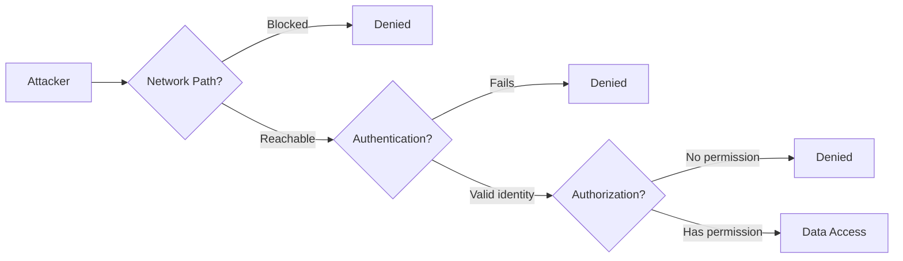
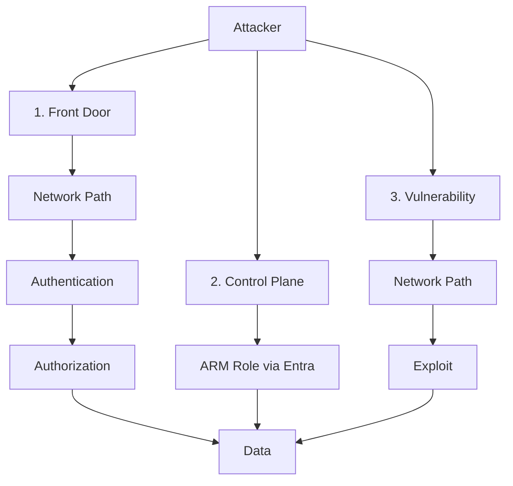

# Azure Access Paths: Network + Authentication + Authorization

A reference for understanding what an attacker actually needs to access Azure PaaS resources (Key Vault, Storage, SQL Database) and infrastructure (Virtual Machines), and which controls enterprises use to break each part of that chain.

---

## Table of Contents

1. [The Core Principle](#1-the-core-principle)
2. [Defense in Depth](#2-defense-in-depth)
3. [Key Concepts](#3-key-concepts)
4. [Access Requirements by Resource](#4-access-requirements-by-resource)
5. [The Three Ways In](#5-the-three-ways-in)
6. [Securing the Network Path](#6-securing-the-network-path)
7. [Securing Authentication and Authorization](#7-securing-authentication-and-authorization)
8. [Worked Attack Scenarios](#8-worked-attack-scenarios)
9. [Common Misconceptions](#9-common-misconceptions)
10. [Quick Checklist](#10-quick-checklist)
11. [References](#11-references)

---

## 1. The Core Principle

> **To access data, an attacker needs ALL THREE:**
> **Network Path + Authentication + Authorization**

| Requirement | Question it answers | Example |
|---|---|---|
| **Network path** | Can my packets reach the resource? | Can I connect to `10.1.2.5:443` or the public endpoint? |
| **Authentication (AuthN)** | Who am I, and can I prove it? | Valid Entra token, storage key, SQL login, RDP password |
| **Authorization (AuthZ)** | What am I allowed to do? | RBAC role, database permission, local admin group |

**Why this matters:** Each requirement is a gate. Security controls exist to close each gate independently, so that when one fails (a leaked key, a misrouted subnet, an overprivileged role), the others still stop the attacker.

---

## 2. Defense in Depth

Defense in depth means **layering independent controls** so no single failure leads to a breach.

| Layer | Control examples | What it stops |
|---|---|---|
| **Perimeter** | Firewall (e.g. Palo Alto in hub), no public IPs, public network access disabled | Internet-originated attacks |
| **Network segmentation** | NSGs on subnets, UDRs through the firewall, private endpoints | Lateral movement between workloads |
| **Identity (AuthN)** | Entra-only auth, MFA, Conditional Access, local auth disabled | Stolen passwords, keys, brute force |
| **Access (AuthZ)** | Least-privilege RBAC, PIM, database roles | Overprivileged or compromised identities |
| **Data** | Encryption, Key Vault, purge protection | Data exposure if other layers fail |
| **Detection** | VNet flow logs, diagnostic logs, SIEM, Defender for Cloud | Undetected abuse |

### How the layers cover each other

| If this fails… | …this still protects you |
|---|---|
| A key or token leaks | NSG limits which hosts can use it |
| NSG is misconfigured or bypassed | Entra-only auth + least-privilege RBAC limit who gets in |
| A workload is compromised and its managed identity is used | NSG limits what that workload can reach; least privilege limits what the identity can do |
| Firewall is bypassed by routing | NSG still enforces at the subnet |

> **Key point:** Adding an NSG to a subnet is a **network layer control**. It does not replace authentication or authorization; it adds an independent layer that still holds when those fail.

---

## 3. Key Concepts

### Private IP vs. Private Endpoint

| | Private IP | Private Endpoint (PE) |
|---|---|---|
| What it is | An address from your VNet range (e.g. `10.1.2.5`) | An Azure **resource**: a NIC with a private IP mapped to one PaaS resource via Private Link |
| Who has one | VM NICs, internal load balancers, firewalls, PEs | PaaS resources only |
| Relationship | — | Every PE **has** a private IP; most private IPs are **not** PEs |

### Where PaaS actually lives

| Object | Location |
|---|---|
| Storage account / Key Vault / SQL DB (the data) | Microsoft's multi-tenant infrastructure, **not** your VNet |
| Private endpoint NIC | **Your subnet** |

> **Analogy:** The PaaS resource is a bank vault in Microsoft's building. The private endpoint is a private tunnel entrance built inside **your office** (subnet). The NSG is the badge reader deciding who in your office can walk up to that entrance.

### Control plane vs. data plane

| | Control plane | Data plane |
|---|---|---|
| Purpose | Manage the resource (create, configure, delete) | Use the resource (read secrets, blobs, rows) |
| Endpoint | Azure Resource Manager (`management.azure.com`) | The resource's own endpoint (public or PE) |
| Reachable from internet? | ✅ **Always** | Depends on public access / PE settings |
| Protected by NSG / PE? | ❌ **No** | ✅ Yes |
| Protected by | Entra ID, Conditional Access, RBAC, PIM | Network + AuthN + AuthZ |

### PaaS networking models

| Model | Is the service in your subnet? | Examples | What enterprises usually implement to reduce risk |
|---|---|---|---|
| **Private endpoint** | Only the PE NIC | Storage, Key Vault, SQL DB | Public network access disabled; NSG on the PE subnet with `privateEndpointNetworkPolicies` enabled; UDRs through the hub firewall; centrally managed Private DNS zones in the hub; local auth disabled; Azure Policy to deny public access and require PEs |
| **VNet injection** | ✅ The service itself | SQL Managed Instance, Databricks, AKS, App Service Environment | Dedicated delegated subnet; NSG (often required) that keeps service-required rules but tightens everything else; UDRs forcing egress through the firewall with required service tags allowed; no public IPs (e.g. AKS private cluster, Databricks secure cluster connectivity, SQL MI public endpoint off) |
| **VNet integration** | ❌ Outbound only | App Service, Functions | NSG on the integration subnet to filter outbound traffic; route all outbound traffic through the firewall; pair with a **private endpoint for inbound** and disable public access; access restrictions on the app |
| **Service endpoint** | ❌ Nothing in your subnet | Storage, SQL (legacy approach) | Resource firewall allowing only specific subnets; service endpoint policies (Storage) to block exfiltration to other accounts; migrate to private endpoints for sensitive data |

---

## 4. Access Requirements by Resource

| | **Key Vault** | **Storage Account** | **SQL Database** | **Virtual Machine** |
|---|---|---|---|---|
| **Lives in your VNet?** | ❌ PE NIC only | ❌ PE NIC only | ❌ PE NIC only | ✅ Own NIC |
| **Network path: public** | Public endpoint if public access enabled (optional IP firewall) | Public endpoint if enabled (optional IP/VNet rules) | Public endpoint if enabled; server firewall rules on 1433 | Public IP on NIC (RDP 3389, SSH 22, app ports) |
| **Network path: private** | PE private IP (443) | One PE **per sub-resource** (blob, file, queue, table, dfs) on 443 | PE private IP (1433) | Private IP from VNet, peered VNets, or on-prem |
| **Authentication options** | **Entra only** (user, service principal, managed identity) | Entra token, **shared key**, **SAS**, user delegation SAS, anonymous (if enabled) | Entra or **SQL logins** | **Local accounts**, **domain accounts** (Kerberos/NTLM), SSH keys, Entra login (with extension) |
| **Can be Entra-only?** | ✅ Always | ✅ `allowSharedKeyAccess = false` | ✅ Entra-only authentication setting | ⚠️ Partially; local accounts still exist |
| **MFA / Conditional Access** | ✅ Applies | Entra only; ❌ keys/SAS bypass it | Entra only; ❌ SQL logins bypass it | ❌ Not for local/domain logins |
| **Authorization (data)** | RBAC (e.g. Key Vault Secrets User) or legacy access policies | RBAC data roles (e.g. Storage Blob Data Reader). ❌ **Shared key = full access, no AuthZ check** | **Database permissions** (e.g. `db_datareader`), **not** Azure RBAC | Local groups (Administrators, Remote Desktop Users); RBAC login roles with Entra login |
| **Access without credentials** | ❌ None practical | Anonymous blob access, if enabled | ❌ None practical | ⚠️ Pre-auth exploits (e.g. BlueKeep), vulnerable services |
| **Control-plane shortcut** (bypasses NSG/PE/firewall) | Key Vault Contributor can edit **access policies** to grant itself access (legacy model) | Contributor / Storage Account Contributor can call **`listKeys`** | Contributor can **reset SQL admin password** or add firewall rules | VM Contributor can use **Run Command** (SYSTEM/root), **reset passwords**, **snapshot & mount disks** |
| **Most realistic attack path** | Compromised workload's managed identity; stolen token | Leaked key/SAS in code, config, or repos | Leaked SQL credentials in connection strings | Password spray, credential reuse, pass-the-hash, unpatched services |
| **Where access is logged** | Key Vault AuditEvent + Entra sign-in logs | Storage diagnostic logs. ⚠️ Key/SAS use **never appears in Entra logs** | SQL auditing; Entra sign-in logs (Entra auth only) | Windows 4624/4625, Linux auth logs; Activity Log for Run Command |
| **Key hardening** | RBAC permission model, public access off, PE + NSG | Shared key off, anonymous off, public access off, PE + NSG | Entra-only auth, public access off, "Allow Azure services" off, PE + NSG | No public IP, Bastion/JIT, NLA, patching, LAPS, NSG, Entra login |

---

## 5. The Three Ways In

| Path | What the attacker needs | Does NSG / PE help? | Primary defense |
|---|---|---|---|
| **1. Front door (data plane)** | Network path **+** AuthN **+** AuthZ | ✅ Yes | NSG, PE, firewall, Entra-only auth, least privilege |
| **2. Control plane (ARM)** | Entra identity with an ARM role (Contributor, VM Contributor, etc.) | ❌ No; ARM is always internet-reachable | Conditional Access, MFA, PIM, least-privilege RBAC |
| **3. Vulnerability** | Network path **only** | ✅ Yes; network is the only barrier | NSG, no public IPs, patching |

### How each path applies per resource

These three paths apply to **every resource in this guide**, both PaaS (Key Vault, Storage, SQL Database) and IaaS (Virtual Machines). What changes is how each path looks for each resource.

| Path | **Key Vault** | **Storage Account** | **SQL Database** | **Virtual Machine** |
|---|---|---|---|---|
| **1. Front door** | Reach public endpoint or PE (443) + Entra token + RBAC role | Reach public endpoint or PE (443) + Entra token, key, or SAS + data role (none needed with a key) | Reach public endpoint or PE (1433) + Entra or SQL login + database permissions | Reach public or private IP (3389/22/app ports) + local or domain credentials + local group membership |
| **2. Control plane** | Key Vault Contributor edits access policies (legacy model) | `listKeys` → full data access | Reset SQL admin password; add a firewall rule | Run Command, password reset, disk snapshot & mount |
| **3. Vulnerability** | Rare; platform patched by Microsoft | Rare; misconfiguration (anonymous blob access) is the realistic risk | Rare in the platform; **SQL injection through the app** is the realistic risk, using the app's legitimate connection | **Highest risk**: you own OS and software patching |

> **Shared responsibility:** For PaaS, Microsoft patches the platform, so path 3 is mostly about misconfiguration and the apps in front of it. For VMs, patching is your responsibility, so path 3 is a real and common attack path.

> **Takeaway:** NSGs and private endpoints defend paths 1 and 3. Path 2 is purely an identity problem. A complete security posture covers both.

---

## 6. Securing the Network Path

### Subnets are NOT segmentation by themselves

Every subnet gets this default system route:

| Address prefix | Next hop |
|---|---|
| Entire VNet address space (e.g. `10.1.0.0/16`) | Virtual network |

Azure routes **freely between all subnets** in a VNet. Subnets are the *design*; NSGs are the *enforcement*.

| Component | Provides | Enforces segmentation? |
|---|---|---|
| VNet | Boundary from other VNets and the internet | ✅ At VNet level |
| Subnets | Logical grouping; where controls attach | ❌ Design only |
| NSGs | Restrict by port, protocol, source, destination | ✅ Enforcement |

> **Analogy:** Subnets are lines painted on an office floor labeled "Finance" and "HR." NSGs are the locked doors and badge readers.

### What the NSG protects in each case

| Target | What the NSG filters | Example rule |
|---|---|---|
| **VM with public IP** | Internet traffic to the VM's NIC/subnet | Deny 3389/22 from Internet; allow only from Bastion subnet |
| **VM with private IP** | East-west traffic from other subnets, peered VNets, on-prem | Allow `app-subnet → db-subnet : 1433`; deny the rest |
| **PaaS private endpoint** | Internal traffic to the PE NIC | Allow `app-subnet → pe-subnet : 443`; deny VirtualNetwork |

### NSG default rules (why an "empty" NSG isn't enough)

| Priority | Default rule | What it really allows |
|---|---|---|
| 65000 | `AllowVnetInBound` | Any port from the **VirtualNetwork** tag, which includes **peered VNets and on-prem ranges** |
| 65001 | `AllowAzureLoadBalancerInBound` | Load balancer health probes |
| 65500 | `DenyAllInBound` | Everything else |

### Example least-privilege NSG for a PE subnet

| Priority | Direction | Source | Destination | Port | Action |
|---|---|---|---|---|---|
| 100 | Inbound | `app-subnet` or `asg-app` | `pe-subnet` | 443, 1433 | Allow |
| 110 | Inbound | Approved on-prem ranges | `pe-subnet` | 443 | Allow |
| 4000 | Inbound | VirtualNetwork | Any | Any | **Deny** |

### ⚠️ Private endpoint gotchas

| Gotcha | Impact | Fix |
|---|---|---|
| `privateEndpointNetworkPolicies = Disabled` | NSG is attached but **ignored** for PE traffic (false compliance) | Set to `Enabled` (or `NetworkSecurityGroupEnabled`) |
| PE injects a **/32 route** into its VNet and all peered VNets | More specific than firewall UDRs, so spoke-to-PE traffic **may bypass the firewall** | Enable network policies (`Enabled` or `RouteTableEnabled`) so UDRs can override |
| Creating a PE doesn't disable the public endpoint | Resource still reachable from internet | Set **public network access = Disabled** |

### Hub-and-spoke: firewall vs. NSG

| Traffic path | Hub firewall sees it? | NSG sees it? |
|---|---|---|
| Internet ↔ spoke | ✅ via UDR | ✅ |
| Spoke A ↔ Spoke B | ✅ if UDRs force it | ✅ |
| Subnet ↔ subnet in same spoke | ⚠️ Only with per-subnet UDRs | ✅ |
| VM ↔ VM in same subnet | ❌ **Never** | ✅ |

> The firewall controls traffic **between** zones. The NSG controls traffic **within** a zone.

### Reserved subnets (NSG exceptions)

| Subnet | NSG allowed? |
|---|---|
| GatewaySubnet | ❌ Not supported |
| AzureFirewallSubnet / AzureFirewallManagementSubnet | ❌ Blocked |
| RouteServerSubnet | ❌ Not supported |
| AzureBastionSubnet | ⚠️ Yes, with required rules |
| App Gateway v2 subnet | ⚠️ Yes; allow 65200–65535 from GatewayManager |
| SQL Managed Instance / Databricks | ✅ Required |

### Network path controls summary

| Control | Purpose |
|---|---|
| NSG on every workload and PE subnet | Micro-segmentation |
| PE network policies enabled | Make NSGs and UDRs actually apply to PEs |
| Public network access disabled on PaaS | Remove internet path |
| No public IPs on VMs; use Bastion / JIT | Remove direct internet admin access |
| UDRs through hub firewall | L7 inspection of inter-zone traffic |
| Application Security Groups (ASGs) | Rules follow workload roles, not IPs |
| VNet flow logs + Traffic Analytics | Baseline legitimate traffic before tightening rules |
| Azure Policy (audit → deny) | Prevent subnets without NSGs, public IPs in spokes |

---

## 7. Securing Authentication and Authorization

| Control | Resources | Purpose |
|---|---|---|
| Disable local / shared key auth | Storage, SQL, Cosmos DB, Service Bus, Event Hubs, Azure OpenAI | Force Entra, so MFA, CA, and RBAC apply |
| Entra-only authentication | SQL Database | Remove SQL logins |
| RBAC permission model | Key Vault | Remove access-policy escalation path |
| MFA + Conditional Access | All Entra identities | Protect token issuance |
| PIM for privileged roles | Contributor, Owner, VM Contributor | Remove standing control-plane access |
| Least-privilege managed identities | All workloads | Limit blast radius of a compromised workload |
| LAPS / Entra login for VMs | Virtual Machines | Remove shared or reused local passwords |
| Secret scanning in repos | All | Catch leaked keys, SAS, and connection strings |

---

## 8. Worked Attack Scenarios

### Scenario 1: Leaked storage key

| Step | Detail |
|---|---|
| Setup | Storage account with PE, public access disabled, **shared key enabled**, **no NSG** on PE subnet |
| Attack | Connection string found in a script; attacker compromises any VM in a peered spoke |
| Result | ✅ Network path (no NSG) + ✅ AuthN (key) + ✅ AuthZ (key = full access) → **data accessed** |
| What would have stopped it | NSG on PE subnet **or** shared key disabled |

### Scenario 2: Compromised VM with managed identity

| Step | Detail |
|---|---|
| Setup | App VM's managed identity has Key Vault Secrets User; vault holds a SQL connection string |
| Attack | Attacker compromises the VM, requests a token from IMDS (`169.254.169.254`), reads secrets, connects to SQL PE |
| Result | Every check passes, because the attacker is using the workload's legitimate identity |
| What would have limited it | Least-privilege identity; NSG restricting which subnets reach the SQL PE; monitoring for anomalous secret reads |

### Scenario 3: VM with public RDP

| Step | Detail |
|---|---|
| Setup | VM with public IP, no NSG, local admin account |
| Attack | Password spray within minutes of exposure |
| Result | ✅ Network path + ✅ AuthN (weak password) + ✅ AuthZ (local admin) → **full VM control** |
| What would have stopped it | No public IP; NSG denying 3389 from Internet; Bastion/JIT; LAPS |

### Scenario 4: Control-plane bypass

| Step | Detail |
|---|---|
| Setup | Storage behind PE with strict NSG; attacker phishes a user with standing Contributor |
| Attack | Calls `listKeys` via ARM from the internet, but cannot reach the data plane |
| Result | Network controls hold, but keys are exposed; any later network foothold turns them into data access |
| What would have stopped it | PIM (no standing Contributor), phishing-resistant MFA, shared key disabled |

### Scenario 5: Lateral movement within a subnet

| Step | Detail |
|---|---|
| Setup | Hub firewall inspects all inter-spoke traffic; no NSG in `app-subnet` |
| Attack | Ransomware spreads VM-to-VM over SMB (445) inside the same subnet |
| Result | Firewall never sees the traffic |
| What would have stopped it | NSG denying 445 between VMs in the subnet |

---

## 9. Common Misconceptions

| Misconception | Reality |
|---|---|
| "Multiple subnets = network segmentation" | Subnets route freely by default. NSGs enforce segmentation |
| "A PE means the resource is private" | The public endpoint stays open unless public network access is disabled |
| "An NSG on the PE subnet protects the PE" | Only if `privateEndpointNetworkPolicies` is enabled |
| "An NSG with default rules is secure" | `AllowVnetInBound` permits all VNet, peered, and on-prem traffic |
| "Attackers still need an Entra token and RBAC role" | True only for Entra-only resources. Keys, SAS, SQL logins, and VM passwords bypass Entra |
| "Our hub firewall inspects everything" | Not same-subnet traffic, and possibly not traffic to PEs (/32 routes) |
| "Network controls protect against Contributor abuse" | ARM is always internet-reachable; that's an identity problem |
| "VMs use private endpoints" | VMs have NICs with private IPs; PEs are for PaaS |

---

## 10. Quick Checklist

### Network path
- [ ] NSG attached to every workload and PE subnet (excluding reserved subnets)
- [ ] NSG rules are least privilege, with an explicit deny for VirtualNetwork
- [ ] `privateEndpointNetworkPolicies` enabled on all PE subnets
- [ ] Public network access disabled on PaaS resources with PEs
- [ ] No public IPs on VMs; Bastion or JIT for admin access
- [ ] UDRs send inter-zone and PE traffic through the firewall
- [ ] VNet flow logs enabled

### Authentication
- [ ] Shared key / local auth disabled where supported
- [ ] SQL Entra-only authentication enabled
- [ ] MFA and Conditional Access enforced
- [ ] LAPS or Entra login for VMs

### Authorization
- [ ] Key Vault on RBAC permission model
- [ ] Managed identities scoped to least privilege
- [ ] PIM for Contributor, Owner, and VM Contributor
- [ ] Regular access reviews

### Governance
- [ ] Azure Policy enforcing NSGs, PE network policies, and disabled public access
- [ ] CSPM alerts triaged with reserved-subnet exclusions

---

## 11. References

- [Microsoft Cloud Security Benchmark: Network Security](https://learn.microsoft.com/en-us/security/benchmark/azure/mcsb-network-security)
- [Network security groups overview](https://learn.microsoft.com/en-us/azure/virtual-network/network-security-groups-overview)
- [What is a private endpoint?](https://learn.microsoft.com/en-us/azure/private-link/private-endpoint-overview)
- [Manage network policies for private endpoints](https://learn.microsoft.com/en-us/azure/private-link/disable-private-endpoint-network-policy)
- [VNet flow logs overview](https://learn.microsoft.com/en-us/azure/network-watcher/vnet-flow-logs-overview)

---

> **Remember:** Network Path + Authentication + Authorization. Every control you add should close one of these gates, and no single gate should be the only thing standing between an attacker and your data.
